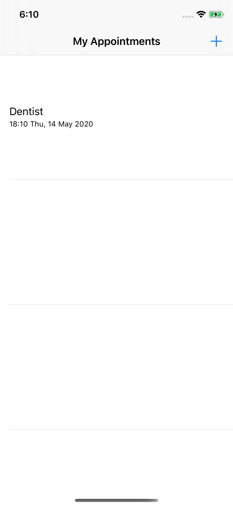

# StarAppointments, iOS Developer: Elias Hall
Appointments App built 100% Programatically

**Run instructions:** Xcode 11.4.1, iOS Deployment Target: 13.4, iPhone 11 Pro

**OverView:** StarAppointments, is an appointments reminder app.

**Walkthrough:** 
The user is presented wih 'My Appointments' view where they can see all created appointments. To add an appointment to 'My Appointments', the user taps on the + icon, The user is then segued to the Add 'Appointment View'. In the 'Add Appointment' view, the user enters name of the appointment into text field, picks the date and time of appointment, then taps on the 'Add" button. The user is automatically dismissed back to 'My Appointments' view, where they can see all added appointments. Adding an appointment will cause a notification to go off on the device, at 7:30am of the appointment's day. The notificaiton will remind the owner, of the name and time of the appointment.

**Tools used: Xcode 11.4.1, UIKit, iPhone simulator/device, iPad simulator/device, Core Data, UserNotifications**

**Select below for larger clearer image**

