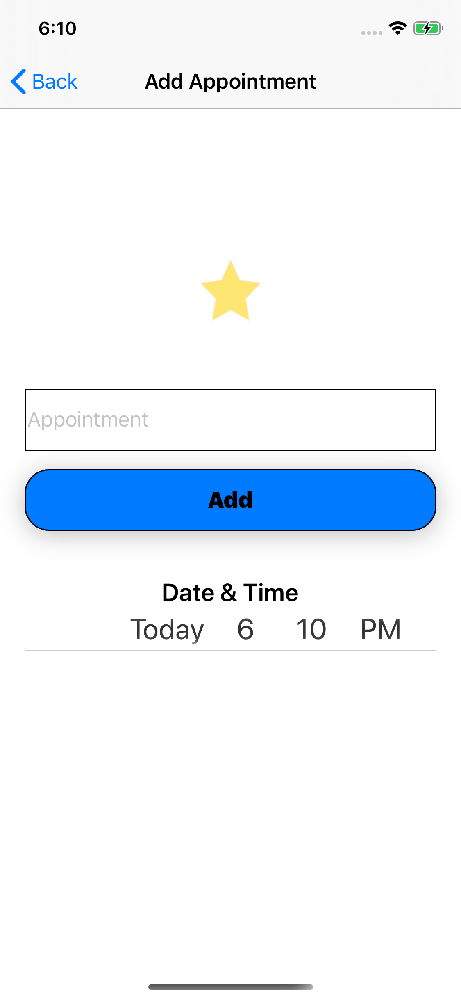
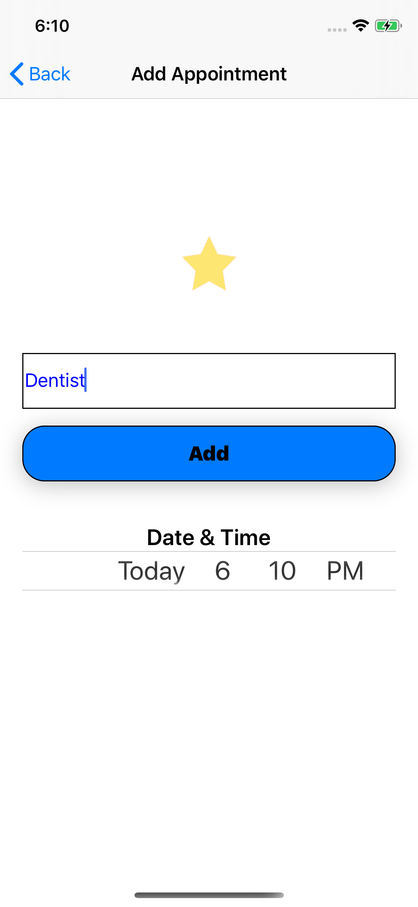
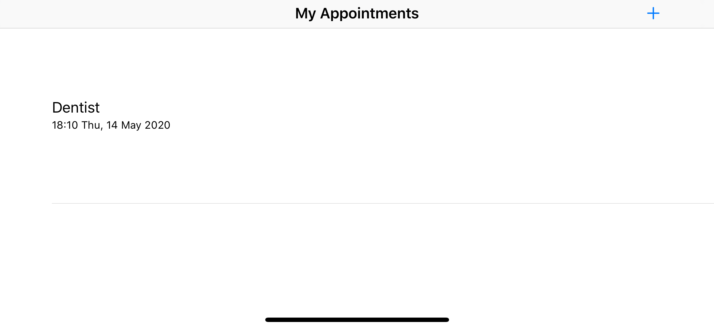
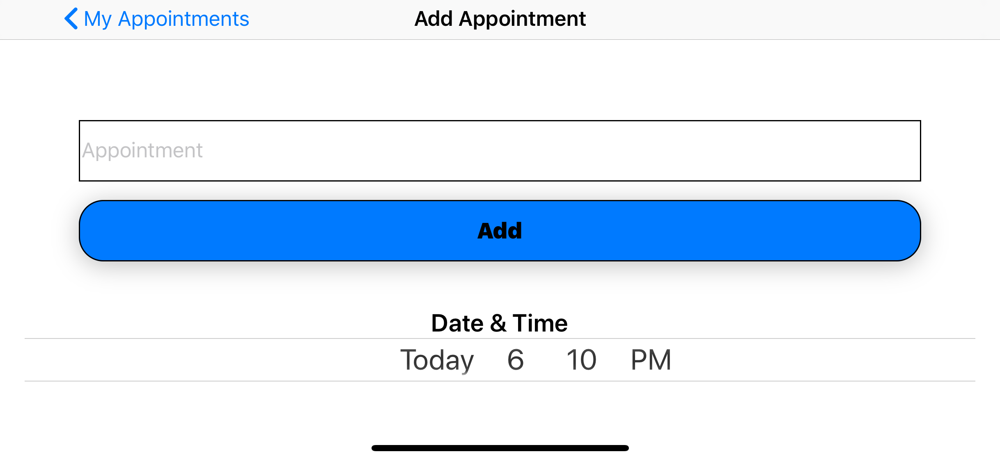

# Star Appointments, iOS Developer: Elias Hall
Appointments App built 100% Programatically

**Run instructions:** Xcode 11.4.1, iOS Deployment Target: 13.4, iPhone 11 Pro

**Overview:** StarAppointments, is an appointments reminder app.

**Walkthrough:** 
The user is presented wih the 'My Appointments' view where they can see all created appointments. To add an appointment to 'My Appointments', the user taps on the + icon, The user is then segued to the Add 'Appointment View'. In the 'Add Appointment' view, the user enters the name of the appointment into the text field, picks the date and time of the appointment, then taps on the 'Add" button. The user is automatically dismissed back to the 'My Appointments' view, where they can see all added appointments. Adding an appointment will cause a notification to go off on the device, at 7:30am on the appointment's day. The notificaiton will remind the owner, of the name and time of the appointment. To delete an appointment, the user will swipe the table cell. The table cell's appointments are saved using Core Data.

**Tools used: Xcode 11.4.1, UIKit, iPhone simulator/device, iPad simulator/device, Core Data, UserNotifications**

**Select below for larger clearer image**

